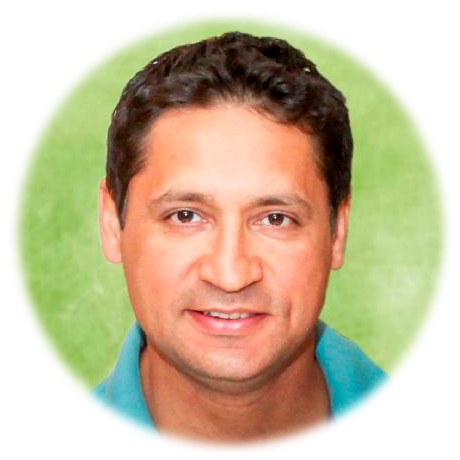

# Portfolio 

## Web Developer - Eldar Humbatov 

Student at [UofT SCS Coding Boot Camp](https://bootcamp.learn.utoronto.ca/coding/landing-ftpt/)

Future Full Stack Developer with mastery in HTML, CSS, JavaScript, jQuery, Responsive Design, Bootstrap, React.js, MySQL, MongoDB, Server-Side Development: Node.js, Express, Progressive Web Applications, MERN Stack (MongoDB, Express.js, React.js, Node.js), API Interaction: API, JSON, AJAX.

## Installation

Portfolio can be accessed at [elogonme.github.io/portfolio/](https://elogonme.github.io/portfolio/)

## Repository

All the `code` is available at repository [github.com/elogonme/portfolio](https://github.com/elogonme/portfolio)

## Credits

Coded by Eldar Humbatov [github.com/elogonme](https://github.com/elogonme)

## License

This source code is available to everyone under the standard 